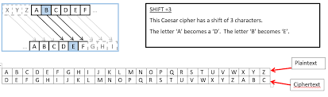
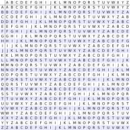

# Substitution Ciphers

## Caesar Cipher

Given Message

```text
Hello World
```

You shift the letters of the alphabet 



Now you have a table , according to the table above A = D, D = G, and so forth.

So now:

```text
Hello world :: Plaintext
Khoor zruog :: Cipher Text
```

## Vigenère Cipher

Given the same text

```text
Hello World
```

So now we have this Vigenère Square



With this now we make up a key

```text
key = script
```

Now we make the key the same number of letters as the plaintext and then following the square find the letters matching for example "F" and "G" would turn into "L"

```text
HelloWorld :: Plaintext
ScriptScri :: Key
zgctdpgtcl :: Ciphertext
```

### Kasiski Test

If you were given a cipher text that you know is a Vigenère cipher, one test that you can do is the Kasiski Test. 

So given a cipher text 

**Ljv odtd qw ARKARK qh mg gekdnjcxm hmmfvvil lq vvwtfev bwxat jsxedu zv rrtgi atvmtzbn pavy i uhuwj wc vjagbdzjcgpn tff Gcqeae Bmn Bfhiihmjwtbjkw \(RBQ\), gxngiat xfizvtxjkeo, hxuwim rhvkeo, pgv ortltjg rvpequza, hxuwiqir sprtnlau rvs bfezltgl tvaehfuv, icw hgemiksvzwc mwukqcz. KEIQEM okct plkkjb xg ljv ltownfxbxfv fn iawuv azbdnj nghe c Uw-Xm-Qqlzhxdh gmglhgtbxow cel tguqlzpzw ovuqxju kw qnanu vtp kqccibgpj icw uqebgbtwkm ih wzzaibfi fvtl.**

You can input the text [here](http://practicalcryptography.com/cryptanalysis/text-characterisation/monogram-bigram-and-trigram-frequency-counts/) to solve for the monogram, bigram, and trigram frequency. 

In this specific case the bigram with the most frequency is **uw**.

Next you find the distances between each instance of **uw.** Then after that find the gcd of the distances and that will give you the possible key sizes and in this case it is 6.


