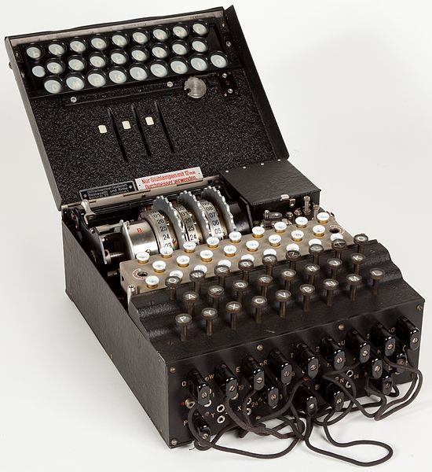

# Enigma Machine

It wouldn't be a cryptography guide if the Enigma Machine was not introduced.

## Background





Making your messages secret in a war is one of the keys of success in winning. In World War II the Nazis had their messages encoded with this machine. To win the war the allied nations had to decipher and crack the code that the Nazis were using to encode their messages. 

## How it works

The box has 3 rotors with a different combination of wires to scramble the plaintext using substitution ciphers. 

The cipher changes with every turn of the rotors and they had an option choosing 3 out of 5 rotors.

```text
ABCDEFGHIJKLMNOPQRSTUVWXYZ :: Plaintext 
EKMFLGDQVZNTOWYHXUSPAIBRCJ :: 1st rotor
AJDKSIRUXBLHWTMCQGZNPYFVOE :: 2nd rotor
BDFHJLCPRTXVZNYEIWGAKMUSQO :: 3rd rotor
ESOVPZJAYQUIRHXLNFTGKDCMWB :: 4th rotor
VZBRGITYUPSDNHLXAWMJQOFECK :: 5th rotor
```

So choosing the rotors would give

**5\*4\*3 = 60 options for rotors.**

You then have 3 rotors scrambling the 26 letter alphabet and you can change it with a turn.

**26^3 = 17576 possible combinations**

However the first rotor kicked the second rotor so you lose an option for rotor 2. This is called double-stepping. 

**26\*25\*26 = 16900 possible combinations**

In addition to the rotors there was a plug-board on the side. On the side there are plugs with the alphabet on the side. Essentially you plug in the wires and connect two letters and then the letters will be substituted. So if you connect A-Z then A is now Z and Z is now A. 

