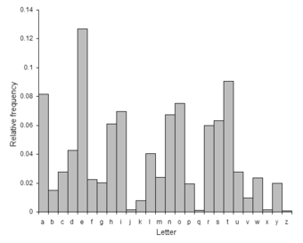
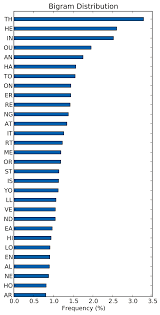

# Intro

## The Math

Cryptography as a whole involves in a lot of math. Most of the information included can be found in any "Discrete Mathematics" courses. 

## English Statistics

For most of the time in this book we will be using the English Language. If you are from another country or English is not your main language I apologize. 

If you have ever played the game "hangman", you instinctively choose letters that the most frequency in the English language. An early way of Cryptography was using _**Substitution Cryptography.**_ This is a cryptographic method in which each letter is substituted for another letter. Examples of this are the [Caesar Cipher](../common-ciphers.md#caesar-cipher) or the [Vigenère Cipher](../common-ciphers.md#vigenere-cipher).

Using the above graph if you find out what letters appear in the **plaintext** most often chances are they correlate to the above graph. You can then apply the same method to **Bigrams** and **Trigrams**

Another characteristic of English is the **Index of Coincidence.** It essentially is the probability in a given text, if all of the letters were put in a hat how likely is it that the letters are both the same and in the English Language is is about .06. So if you use the **Index of Coincidence** on a cipher text and it gives .06. It is most likely a substitution cipher. 

