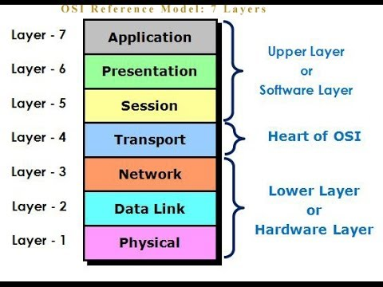

# Network

Networks is an important part of cyber security. It is the way that communications between computers are connected and utilizing this communication can be used for nefarious purposes.

## OSI Model

### Application Layer

     The application layer is the only layer that is closest to the end user. ex. HTTP

### Presentation Layer

    

