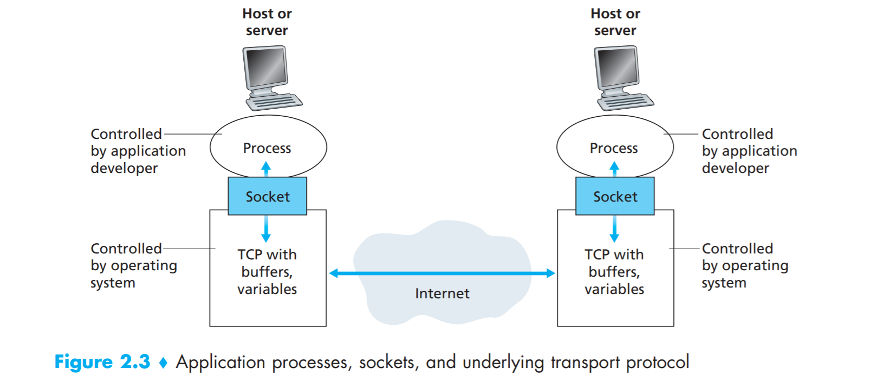
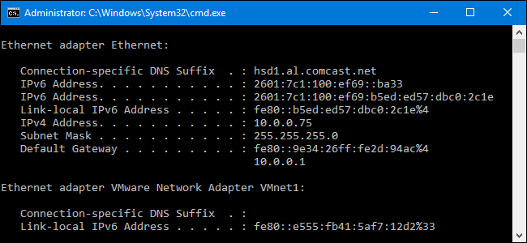

# Socket Programming

## Client and Server

The way that we mostly interact on the internet is through the client server model

A **Client**  is an endpoint and usually asks information to be received from a **Server**

A **Server** is a system in which it can reply to a client's requests via code or response.

**Client Code example is listed** [**here**](https://github.com/CPP-SCRIPT/Examples/blob/master/Networks/WINclient.cpp)\*\*\*\*

**Server Code example is listed** [**here**](https://github.com/CPP-SCRIPT/Examples/blob/master/Networks/WinServer.cpp)\*\*\*\*

For handling big data companies might employ the use of Data Centers or Server Farms to handle all of the Client Request.

## Features

Every computer has an ipaddress if you want to find out your ip address open windows command prompt or terminal if you are in linux or mac and then type in _**ipconfig**_ or _**ifconfig.**_

You should get something like this

Another feature that is important is port numbers

In the code you can specify port numbers to open or close to then receive information. 

You can find those special numbers [here](https://www.webopedia.com/quick_ref/portnumbers.asp).

