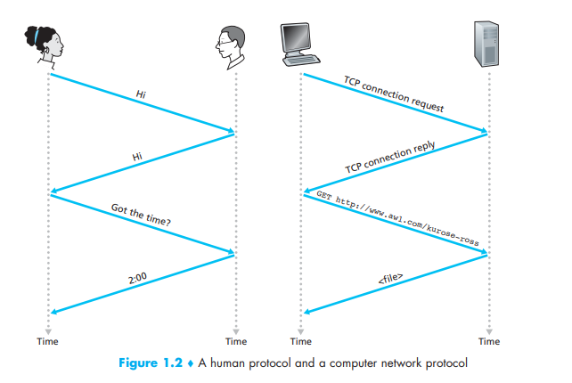

# Protocols

**TCP**

**IP**

Protocols happen the way that we communicate to each other. Much like the diagram below, the computer communicates the same way that we do just in a more literal sense. 

